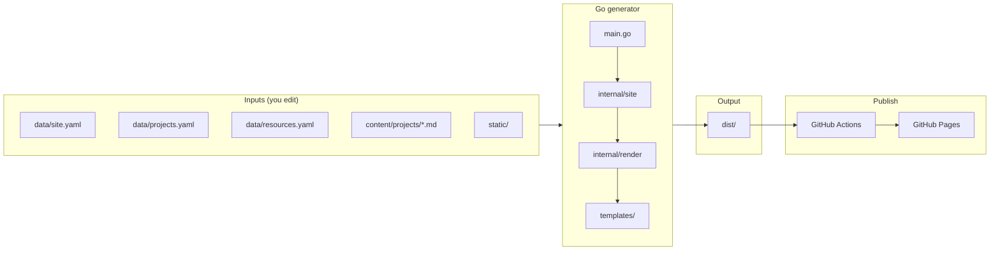

# Tiho GitHub Pages Portfolio

A small Go static site generator for a personal platform-engineering portfolio. It reads YAML and Markdown, renders HTML, and publishes to GitHub Pages.

## Quick start

```bash
# Build site into dist/
go run .

# Build and preview in the browser
go run . -serve
# → http://localhost:8080/
```

| Flag | Default | Description |
|------|---------|-------------|
| `-o` | `dist` | Output directory |
| `-serve` | off | Serve `dist/` after build |
| `-port` | `8080` | Local preview port |

Requires Go 1.26+.

## Project layout

```
.
├── data/                          # YAML inputs — edit often
│   ├── site.yaml                  # name, brand, tagline, GitHub, LinkedIn
│   ├── projects.yaml              # project cards: slug, tags, repo, draft
│   └── resources.yaml             # grouped links (Flux, Cilium, ESO, etc.)
├── content/projects/              # Markdown inputs — one file per project page
│   ├── banking-platform.md
│   ├── aws-eks-reference-platform.md
│   ├── crossplane-study.md
│   └── <slug>.md                  # filename must match slug in projects.yaml
├── static/                        # assets copied as-is into dist/
│   └── style.css                  # colors, layout, header/footer styling
├── templates/                     # HTML page shells (Go html/template)
│   ├── layout.html                # shared header, nav, footer
│   ├── home.html                  # landing page
│   ├── projects.html              # all projects list
│   ├── project.html               # single project page wrapper
│   ├── resources.html             # resources list page
│   └── partials.html              # reusable fragments (e.g. project card)
├── internal/                      # Go packages — change when extending the generator
│   ├── config/                    # loads data/site.yaml, brand name
│   ├── projects/                  # loads data/projects.yaml, filters drafts
│   ├── resources/                 # loads data/resources.yaml
│   ├── markdown/                  # GFM → HTML, Mermaid block transform
│   ├── render/                    # executes templates → dist/*.html
│   ├── static/                    # copies static/ → dist/
│   └── site/                      # Build() — orchestrates the full pipeline
├── main.go                        # CLI entry: go run . / -serve / -o dist
├── .github/workflows/pages.yml    # CI: vet, build dist, deploy to GitHub Pages
└── dist/                          # generated site (gitignored — never edit)
```

**Day to day:** edit `data/`, `content/`, `static/` → `go run . -serve`  
**Generator:** `main.go`, `internal/`, `templates/` — change when adding pages or build logic  
**Do not edit:** `dist/` — rebuilt on every run

## Architecture



**Pipeline:** YAML + Markdown → `go run .` → static HTML in `dist/` → browser or GitHub Pages.

GitHub Pages does not run Go. It only serves the files in `dist/`. CI builds that folder on each push to `main`.

Mermaid in this README renders on GitHub. Mermaid in project markdown (`content/projects/*.md`) renders on the live site.

## Site pages

| URL | Content |
|-----|---------|
| `/` | Home — hero + featured project cards |
| `/projects/` | All published projects |
| `/projects/banking-platform/` | Tiho Banking Platform write-up |
| `/projects/aws-eks-reference-platform/` | AWS EKS Reference Platform write-up |
| `/projects/crossplane-study/` | Crossplane Study write-up |
| `/resources/` | Curated tools, docs, and communities |

Nav: **Home · Projects · Resources**

## Current projects

| Slug | Title | Status |
|------|-------|--------|
| `banking-platform` | Tiho Banking Platform | published |
| `aws-eks-reference-platform` | AWS EKS Reference Platform | published |
| `crossplane-study` | Crossplane Study | published |
| `kind-cluster` | Tiho Kind Cluster | `draft: true` (hidden) |

**Slug rule:** `slug` in `projects.yaml` = markdown filename = URL path (`/projects/<slug>/`).

## What to change

### Day to day (content)

| Path | Purpose |
|------|---------|
| `data/site.yaml` | Full name, header brand, title, tagline, social links |
| `data/projects.yaml` | Project cards: slug, summary, tags, repo URL, featured/draft |
| `data/resources.yaml` | Curated tool and doc links, grouped by category |
| `content/projects/<slug>.md` | Full project write-up (Markdown, Mermaid, tables) |
| `static/style.css` | Look and feel (colors, spacing, layout) |
| `static/` | Other assets (images, favicon) copied as-is to `dist/` |

### Occasionally (structure / layout)

| Path | Purpose |
|------|---------|
| `templates/` | HTML shell, home page, project cards, project pages |
| `internal/` | Build logic — only when changing how the site is generated |

## Site configuration

`data/site.yaml`:

```yaml
name: Tihomir Nikolov   # hero, footer, page titles
brand: Tiho             # short name in header only
title: Platform Engineer
tagline: Kubernetes, GitOps, and cloud-native platform work.
github: https://github.com/Tycho-1
linkedin: https://www.linkedin.com/in/tsnikolov-0135
```

Optional env override for the header brand:

```bash
PORTFOLIO_BRAND=Tiho go run . -serve
```

## Adding or renaming a project

1. Add an entry to `data/projects.yaml`:

```yaml
- slug: aws-eks-reference-platform
  title: AWS EKS Reference Platform
  summary: One-line pitch for the card.
  tags: [AWS, EKS, Terraform, Kubernetes]
  repo: https://github.com/Tycho-1/aws-eks-reference-platform
  featured: true
  order: 2
```

2. Create `content/projects/aws-eks-reference-platform.md` (filename must match `slug`).

3. Rebuild: `go run . -serve`

To **rename** a project: change `slug` in YAML and rename the markdown file to match.

Mermaid diagrams work in fenced `mermaid` code blocks inside project markdown.

### Draft projects

Set `draft: true` in `projects.yaml` to hide a project from the build until it is ready to publish (e.g. `kind-cluster`).

## CI

Pushing to `main` runs `.github/workflows/pages.yml`: `go vet`, `go run . -o dist`, then deploy `dist/` to GitHub Pages. The `dist/` folder is gitignored — CI builds it on each push.

