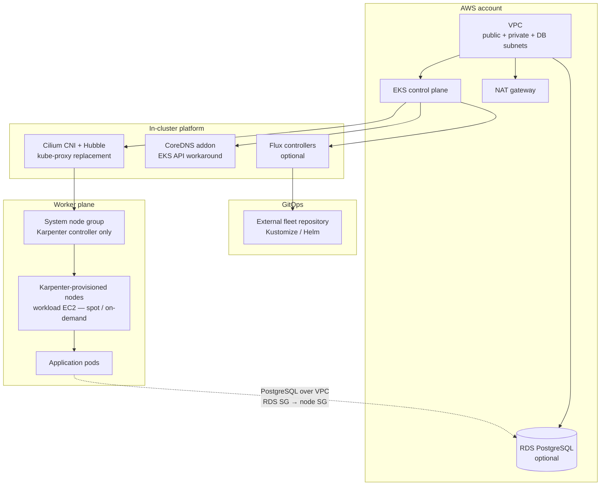
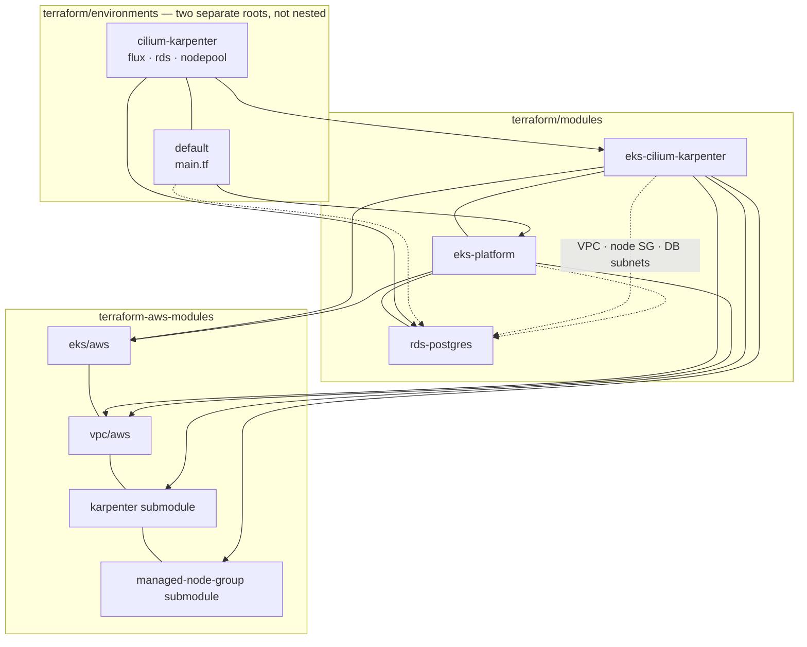
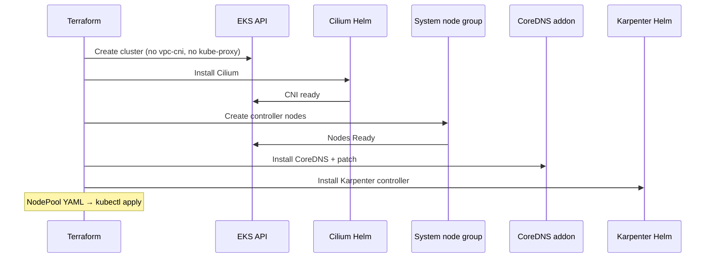

## Summary

A **Terraform reference platform for Amazon EKS** used to demonstrate how a production-shaped Kubernetes cluster is **provisioned, networked, and operated on AWS** — with emphasis on modern platform components (**Cilium**, **Karpenter**, **Flux GitOps**) rather than the default VPC CNI + static node groups.

The work centres on **platform engineering on AWS**: wrapping the community EKS module with opinionated defaults, solving real bootstrap ordering problems (Cilium before nodes, CoreDNS on EKS), and leaving a path for GitOps-driven workloads. It is designed to pair with application repos (for example a Kustomize-based microservice estate) that consume a cluster bootstrapped from this platform.

---

## Overview

| | |
|---|---|
| **Platform** | Amazon EKS on AWS (VPC, IAM, optional RDS) |
| **IaC** | Terraform — internal modules wrapping `terraform-aws-modules/eks` and `terraform-aws-modules/vpc` |
| **Primary environment** | `cilium-karpenter` — Cilium CNI, kube-proxy replacement, Karpenter autoscaling, optional Flux + RDS |
| **Reference environment** | `default` — EKS with AWS VPC CNI and optional managed node group |
| **Focus of this work** | Cluster bootstrap, CNI/Karpenter integration, GitOps bootstrap, AWS networking and identity |
| **Default region / version** | `eu-central-1`, Kubernetes **1.34** |
| **Status** | **cilium-karpenter** environment tested end-to-end; **default** is code reference only. Demonstration — verify before apply. |

---

## Context

Teams adopting EKS typically start with the AWS-managed **VPC CNI** and **managed node groups**. That path is valid, but many platform teams move toward:

- **eBPF-based networking** (Cilium) — CNI, network policy, observability (Hubble), optional encryption
- **Demand-driven scaling** (Karpenter) — nodes provisioned from pod scheduling signals, not fixed pool sizes
- **GitOps** (Flux) — cluster and platform configuration reconciled from Git after bootstrap

This repository captures that **second path on AWS**: not a tutorial snippet, but a structured Terraform layout (modules + environments) with the ordering and workarounds required to make **EKS + Cilium + Karpenter** actually work — including CoreDNS and Flux controller patches for EKS API access when kube-proxy is replaced.

It complements an application-focused project (portable Kubernetes manifests and overlays) by owning **how the AWS cluster itself is built**.

---

## What was done

### Repository layout

| Layer | Path | Role |
|-------|------|------|
| **Modules** | `terraform/modules/` | Reusable building blocks — not where you run `terraform apply` |
| **Environments** | `terraform/environments/` | Root modules — VPC, EKS, and optional add-ons per target |

### Internal modules

| Module | Wraps (community) | Purpose |
|--------|-------------------|---------|
| **eks-cilium-karpenter** | `terraform-aws-modules/eks/aws` (~> 20), `vpc/aws`, EKS **Karpenter** submodule, **eks-managed-node-group** submodule | Primary stack: Cilium via **Helm**, Karpenter, bootstrap ordering, CoreDNS patch |
| **eks-platform** | Same EKS + VPC community modules | Thin reference: **VPC CNI** addon, optional default node group |
| **rds-postgres** | **No upstream module** — direct `aws_db_instance`, `aws_security_group`, `random_password` | Composable with **any** EKS env that exposes VPC + node SG + DB subnet group; **wired today** only in cilium-karpenter |

Both cluster modules use the **community EKS module** as the base — no long-lived fork. Internal code adds Cilium/Karpenter specifics, subnet tags, and bootstrap sequencing.

### Environments

| Environment | Cluster module | Optional add-ons at env level | Tested |
|-------------|----------------|------------------------------|--------|
| **cilium-karpenter** | `eks-cilium-karpenter` | `rds-postgres`, Flux, Karpenter NodePool YAML | **Yes** |
| **default** | `eks-platform` | None wired yet (RDS/Flux could be added the same way) | Reference only |

### Cilium (CNI + kube-proxy replacement)

- Deployed with **Helm** (not the EKS managed addon path).
- **`bootstrap_self_managed_addons = false`** — EKS does not install vpc-cni or kube-proxy at creation.
- **Install order:** Cilium Helm release → small **system managed node group** (Karpenter controller only) → CoreDNS and eks-pod-identity-agent addons.
- **IRSA** for the Cilium operator (ENI IPAM against the VPC).
- **Hubble** enabled for flow visibility; optional **WireGuard** pod-to-pod encryption.
- **CoreDNS workaround** — `hostNetwork`, explicit `KUBERNETES_SERVICE_HOST` pointing at the EKS API endpoint (required on EKS when kube-proxy is replaced; documented in module README).

### Karpenter (autoscaling)

- Community EKS **Karpenter submodule** — controller IAM, node IAM role, SQS interruption queue, EventBridge rules.
- **EKS Pod Identity** for the Karpenter controller (modern AWS pattern).
- System node group tagged `karpenter.sh/controller: "true"`; workload nodes provisioned via **NodePool** / **EC2NodeClass** (AL2023).
- Default NodePool YAML generated by Terraform; applied with `kubectl` after cluster create (GitOps migration planned).
- Configurable capacity: spot, on-demand, or mixed.

### Flux GitOps (optional)

- Bootstrap via **Terraform Flux provider** in `cilium-karpenter` environment (`enable_flux_gitops`).
- **`terraform-outputs` ConfigMap** in `flux-system` — cluster name, endpoint, region, Karpenter node role ARN for fleet Kustomizations (`postBuild.substituteFrom`).
- **EKS + Cilium patches automated** — `kustomization_override` applies `KUBERNETES_SERVICE_HOST` fixes to Flux controllers and root Kustomization (same API-access pattern as CoreDNS/Karpenter).
- Supports PAT or SSH deploy-key auth; secrets in `terraform.tfvars.secrets` (not committed).

### Optional RDS PostgreSQL

- **`rds-postgres` module** — **not** a wrapper around `terraform-aws-modules/rds`; plain `aws_db_instance` + security group + `random_password`.
- Designed to plug into **any** EKS environment: needs `vpc_id`, node security group, and DB subnet group from the cluster module.
- **Wired today** in `cilium-karpenter/rds.tf` only — focus was the Cilium/Karpenter path, not because RDS is Cilium-specific. **`default`** could get an identical `rds.tf` once `eks-platform` exposes database subnets (same pattern as the README usage example).
- Gated by `create_rds_postgres` (off by default in sample config).

### AWS networking and identity

- **Private subnets** for nodes and workloads; public subnets for NAT only.
- Subnet tags for ELB / internal ELB and **Karpenter discovery** (`karpenter.sh/discovery`).
- **IRSA** (Cilium) and **Pod Identity** (Karpenter).
- **`project_tag`** on all resources for cleanup via AWS Tag Editor after destroy.

---

## Design rationale

| Area | Decision | Rationale |
|------|----------|-----------|
| **EKS base** | Community `terraform-aws-modules/eks/aws` | Battle-tested module for cluster, OIDC, addons, and Karpenter submodule — avoid maintaining a fork of AWS resources. |
| **Cilium** | Helm, not EKS addon | Full control over kube-proxy replacement, IPAM mode, Hubble, and encryption; AWS does not offer Cilium as a first-class managed addon in this setup. |
| **No vpc-cni / kube-proxy** | `bootstrap_self_managed_addons = false` | Single CNI and service dataplane via Cilium; avoids conflicting CNIs and duplicate kube-proxy. |
| **Bootstrap ordering** | Cilium → system nodes → addons | Nodes cannot become Ready without a CNI; CoreDNS cannot schedule without nodes — explicit `depends_on` chain in module. |
| **System node group** | Small managed group for Karpenter only | Karpenter controller needs a stable home; workload nodes are Karpenter-provisioned, not a fixed ASG. |
| **CoreDNS / Flux API access** | `hostNetwork` + cluster endpoint env vars | Known EKS + Cilium limitation: ClusterIP `kubernetes` service does not route to the external API endpoint reliably. |
| **Flux bootstrap in Terraform** | One-shot install; fleet repo owns ongoing state | Platform repo creates the cluster and bootstraps GitOps; application and platform manifests live in a separate Git repository. |
| **Modules vs environments** | Modules = library; environments = roots | Same pattern as application `base` vs `overlays` — one module, many deployment targets. |
| **Second environment (`default`)** | VPC CNI reference | Shows the simpler path when Cilium/Karpenter are not required; same community module wrapper. |
| **RDS as composable module** | Optional env-level module, not inside cluster module | Same `rds-postgres` block can sit beside **eks-platform** or **eks-cilium-karpenter**; only cilium env has `rds.tf` today. Native AWS resources — no `terraform-aws-modules/rds`. |
| **Region** | `eu-central-1` default; `us-east-1` alias for ECR Public | AWS restricts ECR Public `GetAuthorizationToken` to us-east-1 — separate provider alias, not cluster region. |

---

## Architecture

### Platform stack (cilium-karpenter)

RDS is **not** on Kubernetes nodes and **does not** trigger Karpenter. It is a managed service in database subnets. Pods reach it over the VPC when `create_rds_postgres = true`.

### Terraform composition

Solid lines = wired today; dashed = composable (RDS on `default` is the same pattern, not added yet).

**How to read it:** The top box is **not** one environment containing the other. It is two **sibling** folders under `terraform/environments/` — you `cd` into one or the other and run `terraform apply` there. `cilium-karpenter` is the full stack (Flux, RDS wiring, NodePool); `default` is the simpler VPC-CNI reference (`main.tf` only today).

Cilium, Karpenter controller chart, and Flux bootstrap sit **outside** `terraform-aws-modules` (Helm + Flux provider at module/env layer).

### Bootstrap sequence (why order matters)

Further detail: [environment README](https://github.com/Tycho-1/aws-eks-reference-platform/blob/main/terraform/environments/cilium-karpenter/README.md) and [module README](https://github.com/Tycho-1/aws-eks-reference-platform/blob/main/terraform/modules/eks-cilium-karpenter/README.md) in the source repository.

---

## Technology stack

| Layer | Technologies |
|-------|----------------|
| **Cloud** | Amazon EKS, VPC, IAM, RDS PostgreSQL (optional), SQS / EventBridge (Karpenter interruption) |
| **IaC** | Terraform >= 1.5, community EKS and VPC modules (~> 20) |
| **CNI / networking** | Cilium (Helm) — ENI IPAM, kube-proxy replacement, Hubble, optional WireGuard |
| **Autoscaling** | Karpenter — Pod Identity, NodePool / EC2NodeClass, spot or on-demand |
| **Cluster DNS** | CoreDNS (EKS addon) with EKS-specific patch |
| **GitOps** | Flux v2 — Terraform bootstrap provider; external fleet repository |
| **Identity** | IRSA (Cilium operator), EKS Pod Identity (Karpenter) |
| **Secrets (bootstrap)** | `terraform.tfvars.secrets` for GitHub PAT / SSH key (not in state for RDS in prod path — planned ESO) |

---

## Design principles

The project is structured around a small set of recurring ideas:

1. **Community module as foundation** — EKS complexity lives upstream; internal modules encode decisions and ordering, not a rewrite of AWS resources.
2. **Explicit bootstrap graph** — Cilium, nodes, addons, and patches are ordered dependencies, not implicit “apply until it works”.
3. **Platform vs application split** — this repo bootstraps the cluster; workloads and overlays live in Git (Flux fleet) or separate application repositories.
4. **Document known limitations** — EKS + Cilium API access, manual NodePool apply, single NAT for demo cost — trade-offs are stated, not hidden.
5. **Two speeds** — full **cilium-karpenter** path for modern platform engineering; **default** path for VPC CNI comparison without duplicating the entire codebase.
6. **Tag-driven hygiene** — `project_tag` and Terraform tags support finding stray resources after destroy.

---

## Relation to other work

| Project | Role |
|---------|------|
| **[tiho-banking-platform](https://github.com/Tycho-1/tiho-banking-platform)** | Application layer — Kustomize overlays, microservices, portable Kubernetes manifests |
| **This EKS platform** | AWS cluster bootstrap — networking, CNI, autoscaling, GitOps entry point |
| **[aws-solutions-architect-reference](https://github.com/Tycho-1/aws-solutions-architect-reference)** | AWS architecture study notes — VPC, IAM, RDS, ingress patterns that inform platform gaps |

A realistic end-to-end story: **Terraform provisions EKS (this repo)** → **Flux reconciles platform and app manifests (fleet repo)** → **banking-platform overlay runs on the cluster**.

---

## Follow-up work

Honest scope — not yet in the repository:

- **VPC interface endpoints** — S3, ECR, STS (reduce NAT dependency and cost)
- **AWS Load Balancer Controller** — Ingress and L2 cluster entry for HTTP services
- **External Secrets Operator** — RDS and app secrets from AWS Secrets Manager (not Terraform state)
- **Kyverno** — baseline policy enforcement
- **Observability** — Prometheus/Grafana or Datadog; enable Cilium ServiceMonitor in tfvars
- **GitOps NodePool** — move Karpenter NodePool from manual `kubectl apply` into Flux fleet
- **Multi-AZ NAT / private-only API** — production hardening
- **Terraform CI** — plan on pull request
- **default environment** — apply and document as VPC CNI baseline

---

## Attribution and license

Infrastructure code and documentation: [Tycho-1/aws-eks-reference-platform](https://github.com/Tycho-1/aws-eks-reference-platform). Built on [terraform-aws-modules/eks](https://github.com/terraform-aws-modules/terraform-aws-eks) and [terraform-aws-modules/vpc](https://github.com/terraform-aws-modules/terraform-aws-vpc). Cilium and Karpenter are upstream open-source projects installed via Helm and the EKS module Karpenter submodule respectively.
