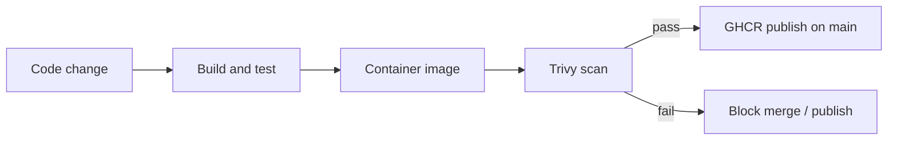
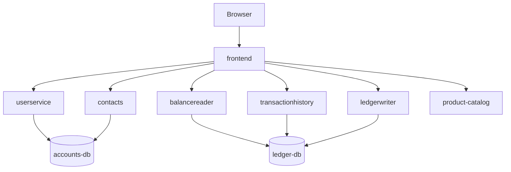
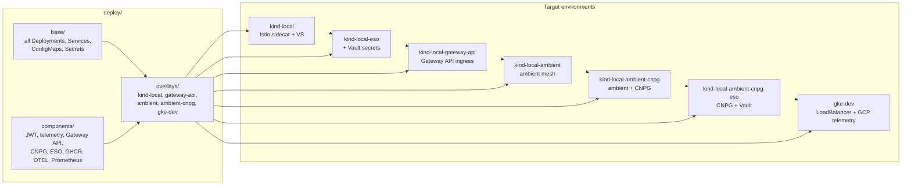

## Summary

A cloud-native retail banking demonstration used to explore how a realistic multi-service application is **designed, deployed, and operated on Kubernetes** — with emphasis on GitOps-friendly manifests, environment portability, and production-shaped platform concerns.

The application layer is based on [Bank of Anthos](https://github.com/GoogleCloudPlatform/bank-of-anthos) (Apache-2.0). The work centres on **platform engineering**: taking an existing service estate and making it deployable on **standard Kubernetes** — without tying manifests to a single cloud vendor — while keeping an optional upstream-shaped path for GKE.

---

## Overview

| | |
|---|---|
| **Application** | Bank of Anthos — 8+ HTTP microservices, JWT auth, two PostgreSQL databases |
| **Languages** | Python (frontend, accounts), Java (ledger), Go (product catalog) |
| **Focus of this work** | Kubernetes deployment, overlays, CI, secrets, databases, mesh, observability |
| **Deploy model** | Kustomize — `base` → `components` → `overlays` |
| **Target runtime** | **Vendor-neutral Kubernetes** (portable overlays); Kind used locally for development |
| **CI** | GitHub Actions — path-filtered per service, optional GHCR image publish |

---

## Context

Bank of Anthos was chosen as a foundation because it resembles systems teams run in practice:

- **Polyglot services** — different runtimes imply different build, test, and container strategies.
- **JWT authentication** — login issues an RS256 token; backends verify signatures and enforce account scope.
- **Two databases** — accounts domain and ledger domain, a common separation in banking-style architectures.
- **Operational surface area** — health checks, configuration vs secrets, telemetry hooks, optional load generation.

The upstream application source is retained intentionally. The exercise is not a greenfield rewrite — it is **how to operationalise an existing microservice codebase**: portable manifests, progressive hardening across overlays, and CI that matches repository structure.

---

## What was done

### Kubernetes deployment (Kustomize)

A three-layer layout separates shared application manifests from environment-specific composition:

| Layer | Role |
|-------|------|
| **base** | Deployments, Services, ConfigMaps, and Secrets for all microservices |
| **components** | Reusable patches — JWT, telemetry, ingress model, CNPG, External Secrets, image registry, observability hooks |
| **overlays** | Per-target bundles — portable Kubernetes (default) and optional GKE-specific |

### Two overlay families

The deployment model separates **portable Kubernetes** from **cloud-vendor-specific** configuration:

| Family | Overlays | Intent |
|--------|----------|--------|
| **Portable Kubernetes** | `kind-local`, `kind-local-gateway-api`, `kind-local-ambient`, `kind-local-ambient-cnpg`, `kind-local-eso`, `kind-local-ambient-cnpg-eso` | Standard Kubernetes APIs only — no GKE, EKS, or AKS assumptions. GCP telemetry and Workload Identity are stripped; ingress uses Istio or Gateway API; observability uses Prometheus and OpenTelemetry. **Kind is the local development cluster used to test these overlays today** — the same manifests apply to any conformant Kubernetes cluster (on-prem, EKS, AKS, Rancher, etc.). |
| **Cloud-specific (reference)** | `gke-dev` | Upstream-shaped **GKE** deployment — LoadBalancer frontend, GCP Cloud Operations enabled. Kept to show the same `base` can also target a vendor-native stack without forking the application. |

Repository overlay names retain the `kind-local` prefix for historical reasons (Kind is where they are developed and validated). **Architecturally they are not “Kind deployments”** — they are cloud-neutral Kubernetes overlays exercised on Kind.

**Portable overlays — capabilities composed:**

| Overlay | Adds on top of portable base |
|---------|------------------------------|
| `kind-local` | Istio sidecar, classic Gateway and VirtualService |
| `kind-local-gateway-api` | Kubernetes **Gateway API** ingress |
| `kind-local-ambient` | Istio **ambient** mesh with waypoint |
| `kind-local-ambient-cnpg` | **CloudNativePG** instead of embedded Postgres StatefulSets |
| `kind-local-eso` / `kind-local-ambient-cnpg-eso` | **External Secrets** sourced from Vault |

**Cloud-specific overlay:**

| Overlay | Intent |
|---------|--------|
| `gke-dev` | GKE reference — LoadBalancer frontend, GCP telemetry enabled |

Deploy manifests are validated in CI (`kubectl kustomize` across all overlays).

### CI/CD (GitHub Actions)

- Path-filtered workflows per service — only changed components are built and tested.
- Per-service semantic versioning via `release.yaml` in each service directory (no monolithic repo version, no `:latest` tag).
- Java services: Maven tests and Jib image builds. Python services: pytest and Docker. Go product catalog: `go test` and Docker.
- Optional image publish to GHCR on `main`, gated by repository variable `ENABLE_IMAGE_PUSH`.
- [Trivy](https://github.com/aquasecurity/trivy) container scanning wired into service workflows (image scan before publish) — change in progress, not yet merged in the public repository.

### Application extension

- **product-catalog** (Go) — read-only bank products API with JWT protection, Prometheus metrics endpoint, and a frontend `/products` page. Demonstrates adding a new service that conforms to existing authentication and deployment patterns.

### Observability (platform-neutral path)

Upstream Bank of Anthos assumes **GCP Cloud Operations**. The **portable Kubernetes** overlays take a vendor-neutral path:

1. GCP telemetry disabled via a shared component patch.
2. **OpenTelemetry OTLP** export configured for frontend, product-catalog, and balancereader (platform Collector assumed).
3. **Prometheus ServiceMonitors** added for product-catalog and balancereader.

The `gke-dev` overlay retains the Cloud Operations path. Portable overlays demonstrate **Prometheus and OpenTelemetry** — suitable for any Kubernetes cluster, not a single cloud. The observability stack itself (Collector, trace backend, Grafana) is platform-owned and lives outside the application repository.

---

## Design rationale

| Area | Decision | Rationale |
|------|----------|-----------|
| **Deploy tooling** | Kustomize as source of truth | Plain YAML with `base` and patches; diffs cleanly in Git and in Flux or Argo CD. Helm remains appropriate for platform charts (Istio, Prometheus); the application stays Kustomize-native. |
| **Repository split** | Application repo vs platform repo | Application manifests should not depend on how a cluster was bootstrapped. Overlay prerequisites are documented; cluster install is out of tree. A public platform reference repository is planned separately. |
| **Portable Kubernetes** | Vendor-neutral overlays on `base` | Strip GCP-specific telemetry, Workload Identity, and ingress assumptions. Target **any standard Kubernetes cluster** — Kind is used locally; EKS, AKS, or on-prem would consume the same overlay with platform-provided prerequisites (mesh, LB, secrets operator). |
| **GKE overlay preserved** | `gke-dev` matches upstream shape | Overlays are additive — the same `base` serves portable Kubernetes and GKE; only ingress and telemetry differ. |
| **Cloud-neutral components** | Composable patches on `base` | Telemetry disabled, workload identity stripped, ClusterIP frontend, GHCR images — not a second copy of every Deployment. |
| **Service mesh** | Istio assumed for microservices | Ingress, policy, and (on the ambient overlay) sidecar-less mesh suit a multi-service HTTP system. Mesh installation is platform-owned; the application sets labels and routes only. |
| **Ingress** | Istio Gateway/VS and Gateway API | Two overlays illustrate both the established Istio ingress model and the **Kubernetes Gateway API** direction. |
| **Secrets** | External Secrets Operator + Vault KV | Demo secrets in Git support one-shot local apply; **ESO is the production-oriented pattern**. The application ships `ExternalSecret` resources; `SecretStore` and Vault authentication are platform-owned. Vault is the reference backend — the same pattern applies to GCP Secret Manager, AWS Secrets Manager, and similar stores. |
| **Databases** | CloudNativePG overlay | Embedded Postgres StatefulSets suit quick demos; **CNPG** is the preferred direction for HA PostgreSQL on Kubernetes. The overlay removes StatefulSets, provisions cluster CRs and seed Jobs, and patches application connection configuration. |
| **Container images** | GHCR on portable overlays; upstream Artifact Registry on `gke-dev` | CI-built images for modified services; upstream images remain usable when the GHCR component is omitted. |
| **GitOps** | Flux | Overlay paths are structured for reconciliation from a platform GitOps repository; Flux configuration is not yet part of the application repo. |
| **Observability** | Prometheus + OTLP on portable overlays; Cloud Ops on `gke-dev` | Portable path for generic Kubernetes; managed cloud telemetry retained as an optional GKE overlay. |
| **Supply chain security** | Trivy in CI | Images are the deployable artifact — scanning at build time catches known CVEs before they reach GHCR or a cluster. Fits the existing per-service workflow model. |

---

## Architecture

### Runtime service map

### Deploy composition

The `kind-local*` overlays target **portable Kubernetes** (validated on Kind locally). `gke-dev` is the cloud-vendor-specific reference path. Overlay directory names retain the `kind-local` prefix for historical reasons — architecturally they are not Kind-only deployments.

### Authentication

1. The user authenticates through **frontend** → **userservice**, which validates credentials against **accounts-db**.
2. **userservice** issues an RS256 JWT (key material from a Kubernetes Secret or Vault via ESO).
3. **frontend** stores the token; backend services verify the JWT and enforce the `acct` claim.

Further detail: [architecture documentation](https://github.com/tycho-1/tiho-banking-platform/blob/main/docs/architecture.md) and [deploy guide](https://github.com/tycho-1/tiho-banking-platform/blob/main/deploy/README.md) in the source repository.

---

## Technology stack

| Layer | Technologies |
|-------|----------------|
| **Languages** | Python 3, Java 17 (Spring Boot), Go |
| **Data** | PostgreSQL — StatefulSet or CloudNativePG |
| **Containers** | Docker; Java images via Jib |
| **Orchestration** | Kubernetes |
| **Configuration** | Kustomize, ConfigMaps, Secrets / ExternalSecrets |
| **Ingress and mesh** | Istio (sidecar and ambient), Kubernetes Gateway API |
| **Secrets** | External Secrets Operator; HashiCorp Vault as reference backend |
| **CI** | GitHub Actions → GHCR |
| **Observability** | Prometheus ServiceMonitors, OpenTelemetry OTLP; GCP Cloud Operations on GKE |
| **Load testing** | Locust (optional) |

---

## Design principles

The project is structured around a small set of recurring ideas:

1. **Separation of concerns** — application manifests, cluster bootstrap, secrets management, and observability each have a clear owner.
2. **Overlays, not forks** — one shared `base`, many targets. A new cloud environment should be a thin overlay, not a copy of every manifest.
3. **Progressive hardening** — demo secrets in Git → ESO and Vault; embedded Postgres → CNPG; GCP telemetry → OTLP and Prometheus. The application stays the same; the overlay gets stricter.
4. **CI aligned with repository layout** — path filters, per-service versions, deploy validation on every overlay.
5. **Transparent upstream use** — Bank of Anthos is attributed and version-pinned; scope is operability, not a from-scratch rewrite.
6. **Documented trade-offs** — components and overlays explain *why* they exist, not only how to apply them.

---

## Follow-up work

- **Trivy image scanning in CI** — per-service container scans on PR and `main`; not yet merged in the public repository.
- **Public platform repository** — bootstrap for portable Kubernetes (Istio and/or Gateway API controller, load balancer, CNPG operator, Vault and ESO, observability stack).
- **Flux GitOps** — platform repo reconciles a chosen overlay path; overlay structure is already Flux-ready.
- **Full OTEL and Grafana integration** — application-side OTLP and ServiceMonitors exist; Collector, trace backend, and dashboards remain platform-owned.
- **Vault authentication hardening** — move SecretStores from long-lived tokens to Kubernetes auth (platform-side).
- **Cloud-specific overlays** — optional `eks-dev` / `aks-dev` reference paths alongside portable and `gke-dev`.
- **Deploy screenshots** — UI captures from a live portable overlay deploy to replace upstream images.

---

## Attribution

Application code is derived from [Bank of Anthos](https://github.com/GoogleCloudPlatform/bank-of-anthos) (Apache License 2.0). See the [NOTICE](https://github.com/tycho-1/tiho-banking-platform/blob/main/NOTICE) file in the source repository.
