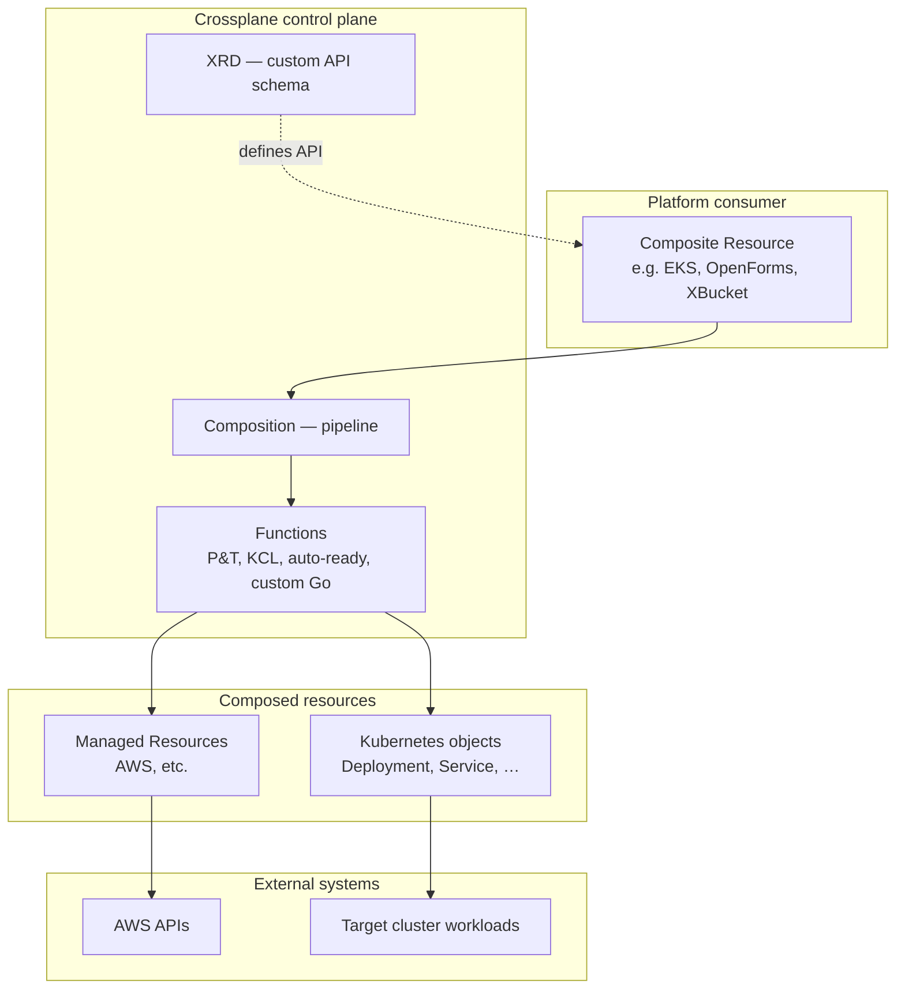
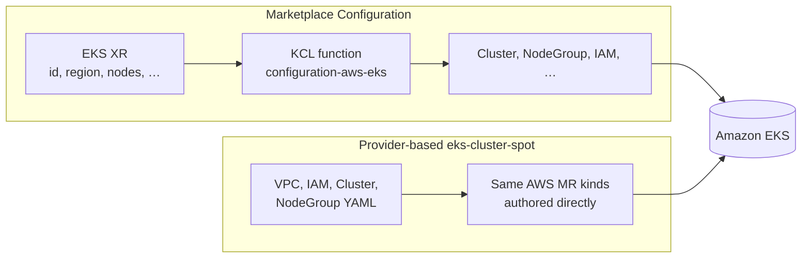
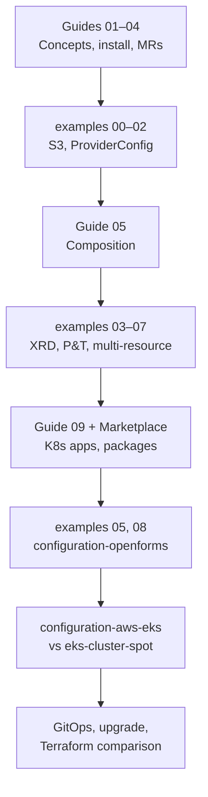

## Summary

A **Crossplane v2 study course and reference repository** used to explore how **Kubernetes-native control planes** define platform APIs, compose cloud and in-cluster resources, and compare with Terraform-style infrastructure workflows.

The work centres on **platform engineering through Crossplane**: custom Composite Resource Definitions (XRDs), pipeline-mode Compositions, Upbound Marketplace packages, and the contrast between **curated platform APIs** (one `EKS` XR) and **provider-based** manifests (full control). It is designed to complement Terraform-based cluster bootstrap and GitOps application repos by documenting the **in-cluster control plane** layer — self-service APIs, package ecosystems, and composition patterns.

---

## Overview

| | |
|---|---|
| **Platform** | Crossplane v2 on Kubernetes — managed resources, XRDs, Compositions, functions |
| **Scope** | Course guides, runnable YAML examples, and three configuration-style projects |
| **Cloud focus** | AWS (EKS, S3, VPC, IAM) via Upbound family providers; Kubernetes app composition (v2) |
| **Primary configurations** | Marketplace EKS (`configuration-aws-eks`), provider-based EKS (`eks-cluster-spot`), OpenForms app (`configuration-openforms`) |
| **Focus of this work** | Platform API design, composition pipelines, Marketplace vs DIY, Terraform mental-model migration, GitOps fit |
| **Status** | Active study resource — guides and examples aligned with [Crossplane v2 docs](https://docs.crossplane.io/latest/); EKS and app configurations documented with install order and troubleshooting |

---

## Context

Teams building internal platforms often choose between:

- **Terraform (or OpenTofu)** — CLI + state file; strong for bootstrap and multi-cloud IaC outside the cluster
- **Crossplane** — control plane *inside* Kubernetes; desired state as CRs; custom APIs for self-service

This repository captures a structured learning path through **Crossplane v2**, which expanded beyond cloud managed resources to **compose any Kubernetes resource** (Deployments, Services, ConfigMaps) and introduced namespaced composite resources, Operations, and pipeline-mode functions.

It complements Terraform EKS work and Kustomize application repos by answering: *how would a platform team expose `EKS`, `OpenForms`, or `MyDatabase` as a single Kubernetes API?* — and *when does a Marketplace Configuration beat hand-written provider YAML?*

---

## What was done

### Repository layout

| Layer | Path | Role |
|-------|------|------|
| **Curriculum** | `Crossplane_Curriculum.md` | Table of contents, learning path, topic → example mapping |
| **Guides** | `guides/` | 23 narrative topics — installation through GitOps, Marketplace, Terraform comparison |
| **Examples** | `examples/` | Progressive hands-on YAML — S3, XRD + Composition, Patch & Transform, K8s apps, CUE, Up CLI |
| **Configurations** | `configuration-aws-eks/`, `configuration-openforms/`, `eks-cluster-spot/` | Real-world-style platform packages and contrasts |
| **Sample platform** | `my-platform/` | Minimal custom XRD + Composition + `crossplane.yaml` package metadata |

### Course guides (selected topics)

| Area | Guides | Intent |
|------|--------|--------|
| **Foundations** | What is Crossplane, v2 changes, installation, managed resources | Core concepts and provider setup |
| **Composition** | XRDs, Compositions, functions, K8s applications | Custom APIs and pipeline mode |
| **Operations & packages** | CronOperation, crossplane CLI, xpkg, Configurations | Day-two and packaging |
| **Ecosystem** | Upbound Marketplace, contrib vs Upbound AWS family, GitOps | Production-adjacent concerns |
| **Comparisons & tooling** | Crossplane vs Terraform, TF modules vs Configurations, Helm → Crossplane, CUE/KCL, Up CLI | Bridge from familiar IaC workflows |

### Runnable examples

| Example | Demonstrates |
|---------|--------------|
| `00-official-doc-awsbucket` | Parity with official managed-resources tutorial |
| `03-xrd-composition-bucket` | Custom `XBucket` API → S3 Bucket |
| `04-patch-and-transform` | Function Patch & Transform, `crossplane render` |
| `05-app-with-deployment` / `08-application` | **v2:** XR → Deployment + Service (no cloud MRs) |
| `configuration-from-helm-chart` | `provider-helm` `Release` MR |
| `cue-xrd-composition` | Cue → generated XRD/Composition |
| `up-cli-devex` | Up CLI project init and generate workflow |

### Configuration: Marketplace EKS (`configuration-aws-eks/`)

Uses [Upbound configuration-aws-eks](https://marketplace.upbound.io/configurations/upbound/configuration-aws-eks) — one **`EKS`** composite resource instead of separate Cluster, NodeGroup, IAM, and VPC manifests.

| Deliverable | Purpose |
|-------------|---------|
| Install manifests | Provider family, Network + EKS Configuration packages, ProviderConfig variants |
| Example XRs | `network-xr-example.yaml`, `eks-xr-example.yaml`, Kustomize workflow for shared VPC/EKS `id` |
| Deep-dive docs | HOW-IT-WORKS, KCL `main.k` line-by-line, local `crossplane render`, XR parameter reference |
| Troubleshooting | contrib vs Upbound family conflicts, ProviderConfig naming, async AWS teardown on delete |

### Configuration: provider-based EKS (`eks-cluster-spot/`)

Raw AWS provider manifests — VPC, IAM, EKS cluster, Spot node group — as a **deliberate contrast** with the Marketplace Configuration. Shows the path when curated APIs are too opinionated (CNI choice, Spot, exotic addons).

### Configuration: OpenForms on Kubernetes (`configuration-openforms/`)

Ports the [maykinmedia/openforms](https://github.com/maykinmedia/charts/tree/main/charts/openforms) Helm chart to **composed Kubernetes resources only** — no `provider-helm` at runtime. Pipeline: Patch & Transform + function-auto-ready.

| Piece | Role |
|-------|------|
| XRD `OpenForms` | Application-level platform API |
| Composition | Embedded chart manifests with P&T patches |
| `scripts/generate_composition.py` | Regenerate composition from `helm template` reference |
| `reference/` | Helm template snapshots for upstream diffing |

Demonstrates Crossplane v2’s **application platform** story — not only “Terraform for AWS in YAML”.

### Custom composition function (`test-up-command/`)

Small Go composition function (function-sdk-go) with CI workflows — pattern for extending pipeline mode beyond built-in functions.

---

## Design rationale

| Area | Decision | Rationale |
|------|----------|-----------|
| **v2-first** | Namespaced XRs, compose any K8s resource, pipeline functions | Align with current Crossplane; avoid v1-only patterns |
| **Two EKS paths** | Marketplace Configuration + provider-based `eks-cluster-spot` | Same goal (EKS), two philosophies — curated API vs full control |
| **Terraform bridge content** | Dedicated comparison and “modules vs Configurations” guides | Most platform engineers arrive from Terraform; document where docs live (`kubectl explain`, Marketplace, doc.crds.dev) |
| **OpenForms port** | P&T embedded manifests, external Redis variant | Shows real app complexity on Composition; generator script for maintainability when upstream chart changes |
| **Progressive examples** | Numbered folders from MR → XRD → P&T → multi-resource → apps | Matches curriculum learning path; each example has README + prerequisites |
| **Honest constraints** | Document ProviderConfig gotchas, XR naming (`demo` for OpenForms), Cilium not in Marketplace EKS API | Study material should state trade-offs, not hide them |
| **Package metadata** | `crossplane.yaml` in `my-platform` and `configuration-openforms` | Shows how configurations ship as versioned OCI packages with `dependsOn` |

---

## Architecture

### Control plane model (Crossplane v2)

### Two EKS approaches (same outcome, different abstraction)

### Repository learning path

Further detail: [Crossplane_Curriculum.md](https://github.com/Tycho-1/crossplane-study/blob/main/Crossplane_Curriculum.md) and [configuration-aws-eks README](https://github.com/Tycho-1/crossplane-study/blob/main/configuration-aws-eks/README.md) in the source repository.

---

## Technology stack

| Layer | Technologies |
|-------|----------------|
| **Control plane** | Crossplane v2, Composition functions (pipeline mode) |
| **Functions** | function-patch-and-transform, function-auto-ready, KCL (Marketplace EKS), custom Go (function-sdk-go) |
| **Cloud providers** | Upbound provider-family-aws, provider-aws-s3; contrib vs Upbound family documented |
| **Packages** | Upbound Marketplace Configurations (EKS, Network), `crossplane xpkg build` |
| **Kubernetes apps** | Composed Deployments, Services, ConfigMaps, PVCs (OpenForms port) |
| **Generation / DevEx** | Cue (`cue-xrd-composition`), Up CLI, `crossplane render` |
| **Helm integration** | `provider-helm` Release example; OpenForms derived from Helm chart via generator |
| **GitOps** | Documented patterns for Argo CD / Flux apply order (guide 10) |

---

## Design principles

The project is structured around a small set of recurring ideas:

1. **Framework, not fixed product** — Crossplane is a control plane you shape; XRDs and Compositions define *your* platform API.
2. **Curated API vs full surface** — Marketplace Configurations trade flexibility for simplicity; provider YAML and forks remain valid escape hatches.
3. **One AWS family per cluster** — Document contrib vs Upbound conflicts explicitly; avoid mixed ProviderRevisions.
4. **Examples match guides** — Every major guide topic maps to a runnable folder in `examples/` or a Configuration.
5. **Compare with Terraform honestly** — Coexistence, not replacement; bootstrap vs in-cluster self-service.
6. **v2 application composition** — Platform engineering includes in-cluster apps, not only cloud buckets and databases.

---

## Relation to other work

| Project | Role |
|---------|------|
| **[aws-eks-reference-platform](https://github.com/Tycho-1/aws-eks-reference-platform)** | Terraform bootstrap for EKS — Cilium, Karpenter, Flux; *how the cluster is built* |
| **[tiho-banking-platform](https://github.com/Tycho-1/tiho-banking-platform)** | Application layer — Kustomize overlays, microservices on Kubernetes |
| **This Crossplane study** | In-cluster control plane — custom APIs, composition, Marketplace packages, Terraform comparison |

A realistic end-to-end story: **Terraform provisions EKS (EKS platform repo)** → **Flux reconciles apps (banking-platform)** → **Crossplane could expose self-service `EKS` or `Database` XRs** on a management cluster or fleet model — this repo documents that third layer and the design choices involved.

---

## Follow-up work

Honest scope — not yet complete in the repository:

- **Curriculum index** — Wire guides 13–17 (Configurations, programmatic YAML, Functions deep dive, xpkg CLI, Up CLI) into the main curriculum table
- **CI validation** — `crossplane render` smoke tests on key examples; YAML lint in GitHub Actions
- **Cilium on EKS via Crossplane** — Documented as TODO (`CILIUM-TODO.md`); fork Marketplace config or use provider-helm `Release`
- **Publish README URL** — Replace placeholder GitHub link in repo README
- **Management-cluster story** — Connect Crossplane XRs explicitly to Flux fleet repo layout used elsewhere
- **Configuration package publish** — Push `configuration-openforms` and `my-platform` to a registry as installable xpkg

---

## Attribution and license

Course materials and configurations: [Tycho-1/crossplane-study](https://github.com/Tycho-1/crossplane-study) (MIT License). Built on [Crossplane](https://crossplane.io/) and the [Upbound Marketplace](https://marketplace.upbound.io/) ecosystem. OpenForms configuration derives manifest structure from [maykinmedia/openforms](https://github.com/maykinmedia/charts/tree/main/charts/openforms) Helm chart v1.12.0. EKS Configuration documentation references upstream [upbound/configuration-aws-eks](https://github.com/upbound/configuration-aws-eks).
